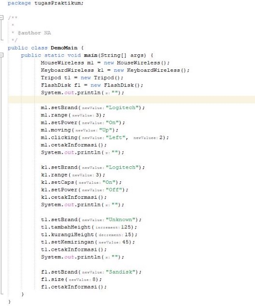

Class Sepeda 

Class Main SepedaDemo 

Hasil : 

Class SepedaGunung 

Class Main yang sudah diubah 

Hasil: 

Pertanyaan  

1. Jelaskan perbedaan antara objek dengan class!  

**Jawaban : objek adalah rangkaian program yang dibuat mirip dengan yang ada di dunia nyata Sedangkan class adalah blueprint atau rancangan objek tersebut** 

2. Jelaskan alasan warna dan tipe mesin dapat menjadi atribut dari objek mobil!  

**Jawaban : karena warna dan tipe mesin termasuk ciri ciri dari objek tersebut** 

3. Sebutkan salah satu kelebihan utama dari pemrograman berorientasi objek dibandingkan dengan pemrograman struktural!  

**Jawaban : dapat mudah dipahami dan lebih efisien** 

4. Apakah diperbolehkan melakukan pendefinisian dua buah atribut dalam satu baris kode seperti **“public String nama,alamat;”?**  

**Jawaban: hal tersebut diperbolehkan** 

5. Pada class SepedaGunung, jelaskan alasan atribut merk, kecepatan, dan gear tidak lagi ditulis di dalam class tersebut!   

**Jawaban: Karena class SepedaGunung telah mewarisi state dan behavior dari class Sepeda**    

Tugas Praktikum  

1\. Lakukan langkah-langkah berikut supaya tugas praktikum yang dikerjakan tersistematis:  

1) Foto 4 buah objek di sekitar kalian dengan 2 objek di antaranya merupakan objek yang mengandung konsep pewarisan (inheritance), contoh: kulkas, kursi, meja ruang tamu, meja belajar sehingga diketahui meja ruang tamu dan meja belajar mewarisi objek meja!  
1) Lakukan pengamatan terhadap 4 objek tersebut untuk menentukan atribut dan methodnya!  
1) Berdasarkan 4 buah objek tersebut, buat class nya dalam Bahasa pemrograman Java!   
1) Perlu diperhatikan bahwa terdapat dua class hasil pewarisan sehingga perlu menambah satu class baru sebagai class yang mewarisi dua class tersebut!  
1) Tambahkan dua atribut untuk setiap class!  
1) Tambahkan tiga method untuk setiap classtermasuk method cetak informasi!  
1) Tambahkan satu class Demo sebagai main!  
1) Instansiasikan satu buah objek untuk setiap class!  
1) Terapkan setiap method untuk setiap objek yang dibuat!  
1) Contoh yang telah disebutkan pada poin 1.a tidak diperbolehkan dipakai dalam pengerjaan tugas praktikum ini!  

` `Jawaban : 

- Mouse Wireless 

- Keyboard Wireless 

- Flashdisk 

- Tripod 

- Mouse 

- Keyboard 

- Mouse Wireless 

- Keyboard Wireless 

- Flashdisk 

- Tripod 

DemoMain 

Hasil : 

